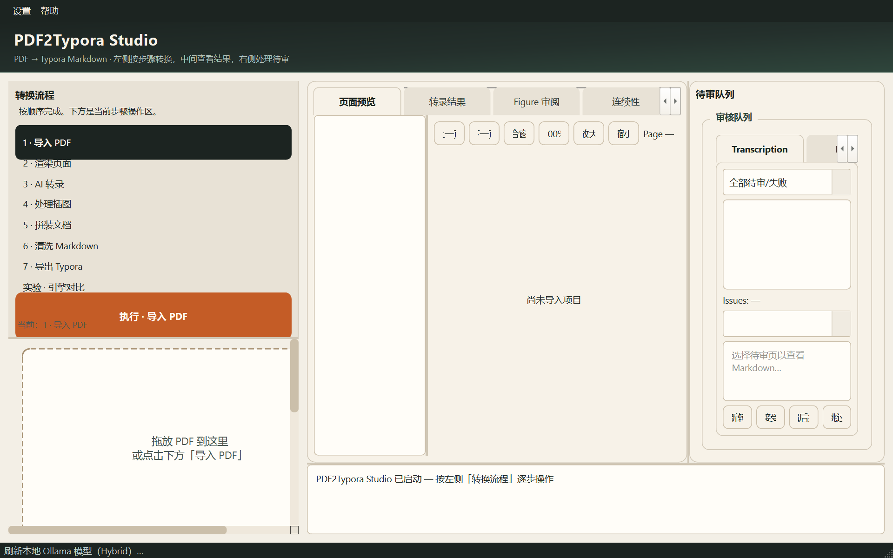

# PDF2Typora Studio

> **Early-stage / actively developed.** APIs, UI, and conversion defaults may still change; expect rough edges and please file issues when something breaks.



把教材、论文一类的 PDF 转成可以在 Typora 里直接打开编辑的 Markdown。

多数「PDF 转 MD」工具要么只抽文字（公式、栏式排版、插图对不齐），要么整页丢给大模型、结果难复核。这个项目做成 Windows 上的桌面流水线：按页渲染、按页转录、按图序裁图、再拼成整篇文档，中间产物都落在项目目录里，方便对照 PDF 检查。

界面是 PyQt6。推理可以用本机 Ollama 的视觉模型，也可以走 Hybrid：本机 OCR 抽版面与文字，再交给 DeepSeek 一类文本 API 整理成 Markdown。API Key 存在系统凭据库，不写进仓库。

## 适合什么场景

- 需要把扫描件或版式复杂的 PDF 变成可编辑 Markdown  
- 希望插图以文件形式嵌进文档，而不是只剩一句「见图 3」  
- 希望过程可暂停、可重跑某一阶段，而不是一次黑盒转换  

当前主流程面向中英文学术/教材 PDF；复杂杂志多栏、强矢量绘图仍可能需要人工改一版。

## 转换流水线

左侧按阶段推进，每个阶段写入固定目录：

| 阶段 | 做什么 | 主要产物 |
|------|--------|----------|
| 导入 | 建立项目、登记页数 | `workspace/<项目名>/`、`project.db` |
| 渲染 | PDF 按页光栅化 | `pages/page_XXXX.png` |
| 转录 | 图/文 → 分页 Markdown | `markdown_pages/`、`page_results/` |
| 插图 | 按图序裁切并替换标记 | `figures/`、`resolved_pages/` |
| 拼装 | 按页序合并 | `intermediate/raw.md` |
| 清洗 | 规则优先的版式清理 | `clean.md` 等 |
| 定稿导出 | 校验后导出 Typora 工程 | `final.md`、`exports/` |

**转录**有两种引擎：

1. **Vision Only** — 把页面 PNG 交给 Ollama 视觉模型，按 JSON schema 产出 Markdown 与插图候选框。  
2. **Hybrid OCR + API** — 先用文档/OCR 链路拿文本与版面线索，再用外部文本模型整理；适合「本地有 OCR、正文交给云端」的组合。

转录结果先作为 *canonical* 写入 `markdown_pages/`。后续插图、拼装只读这份正文，或写到 `resolved_pages/`，不覆盖 canonical，避免改图时把已经校过的文字弄乱。

**插图**默认按正文图序定位（`Fig. 1` / `Figure 2` / `图 3` 等）：有图注就在图注附近（多数在上方，少数在下方）框选裁剪，写入 `figures/`，并在 resolved 页里换成 Markdown 图片链接。配置里 `caption_anchored_auto` 打开时，不再把「匹配分不够」当成必须人工点过的待审项。

**拼装**按物理页序把 resolved（或 canonical）拼成 `intermediate/raw.md`，并做页标记、未解析 FIGURE、跨页连续性等检查。  
**清洗**以确定性规则为主（多余分隔线、印刷页码噪声、围栏等），必要时才调用文本模型，并校验公式、表格、链接、图片是否被误删。  
**导出**生成可交给 Typora 打开的目录（正文 + `figures/` + 可选源 PDF）。

## 技术结构

```
GUI (PyQt6)
  → Workers（后台任务）
    → Services（转录 / 插图 / 拼装 / 清洗 / 导出）
      → AI Providers（Ollama / OpenAI 兼容 API）
      → PyMuPDF（渲染与裁剪）
      → SQLite（页状态、批次、审阅记录）
```

| 目录 | 职责 |
|------|------|
| `gui/` | 主窗口、各阶段面板、审阅与预览 |
| `workers/` | 渲染、批量转录、插图、拼装等 QRunnable |
| `services/` | 业务逻辑与就绪检查 |
| `ai/` | Provider、运行时、文档解析适配、schema |
| `core/` | 阶段枚举、领域模型 |
| `storage/` | 数据库与仓储 |
| `config/` | `default.yaml`；本地覆盖见 `user.yaml.example` |
| `prompts/` | 转录与清洗用提示词 |
| `docs/` | 架构与阶段说明；`docs/design/` 为分阶段设计稿 |
| `tests/` | pytest |
| `workspace/` | 运行时项目根（本地生成，不入库） |

单页编号在界面与数据库里从 1 起；只有进 PyMuPDF 时才转成 0-based。

## 环境要求

- Windows 10 / 11  
- Python 3.11 及以上（建议 3.12）  
- 可选：本机 [Ollama](https://ollama.com) 及视觉模型  
- 可选：DeepSeek 或其他 OpenAI 兼容 HTTP API  

可选依赖（MinerU、Marker、Docling 等）用于引擎对比实验，不是主界面必装项。

## 安装与运行

```bash
python -m venv .venv
.venv\Scripts\activate
pip install -r requirements.txt
```

本地配置（可选）：

```bash
copy config\user.yaml.example config\user.yaml
```

API Key 在应用菜单 **设置 → 外部 API 配置** 中填写。

启动：

```bash
python main.py
```

自动化测试：

```bash
pytest
```

## 配置要点

默认配置在 `config/default.yaml`。常见项：

- `transcription.page_engine`：`hybrid_ocr_api` 或 `vision_only`  
- `figures.caption_anchored_auto`：按图序自动裁剪  
- `assemble.allow_unresolved_figures`：拼装时是否允许未完全解决的插图  
- `ollama.external.base_url`：外置 Ollama 地址  

`config/user.yaml` 仅用于本机覆盖，已加入 `.gitignore`。

## 一个项目目录里有什么

以 `workspace/<项目名>/` 为例：

```
project.db              页状态与批次元数据
pages/                  渲染页图
markdown_pages/         转录正文（canonical）
page_results/           转录 JSON（含 figures 元数据）
figures/                裁切出的插图文件
resolved_pages/         插图已替换后的分页 MD
layout/                 版面/图组清单
intermediate/raw.md     拼装结果
clean.md / final.md     清洗与定稿（跑完对应阶段后才有）
```

日常要打开的整篇稿，一般是拼装后的 `intermediate/raw.md`，或定稿后的 `final.md`。

## 文档

- [架构说明](docs/ARCHITECTURE.md)  
- [阶段路线](docs/ROADMAP.md)  
- [AI Provider 说明](docs/AI_PROVIDER.md)  
- [如何参与 / 提 conversion regression](CONTRIBUTING.md)  
- [安全问题私下报告](SECURITY.md)  
- [分阶段设计稿](docs/design/)  

## 许可与范围

源码以 [MIT License](LICENSE) 发布。仓库不含本地虚拟环境、工作区 PDF、导出结果和 API 密钥。PyQt6 与所用模型 / API 另有各自条款，二次分发或商用前请一并确认。
